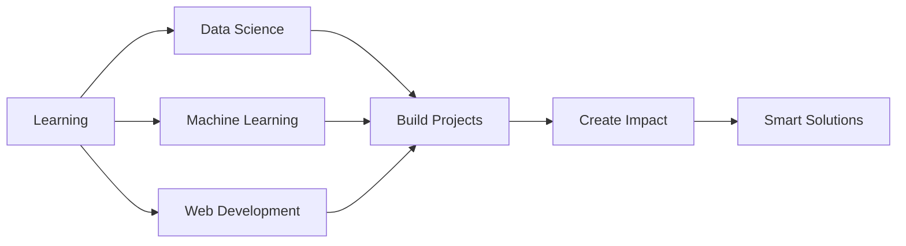

<div align="center">


</div>

<p align="center">
  
  
  
</p>

---


### 👨‍💻 About Me

```javascript
const bhakti = {
    pronouns: "She/Her",
    location: "Shirpur, Maharashtra, India 🇮🇳",
    education: "B.Tech CSE (Data Science)",
    college: "R. C. Patel Institute of Technology",
    background: "Diploma in Computer Science (Polytechnic)",
    
    currentFocus: [
        "Data Science & Machine Learning",
        "Full Stack Web Development",
        "Intelligent Systems",
        "Scalable Solutions"
    ],
    
    passionateAbout: [
        "Data-Driven Engineering",
        "Building Smart Applications",
        "Problem Solving with Code",
        "Continuous Learning"
    ],
    
    funFact: "I debug with console.log() and I'm not ashamed! 😄"
};
```

<br clear="right"/>

---

<h2 align="center">
   
  Tech Stack & Tools
</h2>

<div align="center">

### 💻 Frontend Development

<p>
  
</p>

### 🔧 Backend Development

<p>
  
</p>

### 🗄️ Databases

<p>
  
</p>

### 🛠️ Programming Languages

<p>
  
</p>

### 🎨 Design & Tools

<p>
  
</p>

### 📊 Data Science & ML

<p>
  
  
  
  
  
</p>

</div>

---

<h2 align="center">
  
  Professional Experience
</h2>

<div align="center">

### 🏢 Web Developer Intern
**Softanic Solutions Pvt. Ltd.** • Jalgaon  
*June 2024 - July 2024 (2 months)*

</div>

<table align="center">
<tr>
<td width="50%">

**🎯 Key Responsibilities:**
- Built responsive user interfaces
- Developed backend functionality
- Database management & optimization
- Collaborative team development
- Real-world application projects

</td>
<td width="50%">

**🛠️ Technologies Used:**
- Frontend: HTML, CSS, JavaScript, Bootstrap
- Backend: PHP, Node.js
- Database: MySQL
- Version Control: Git
- Full-stack development workflow

</td>
</tr>
</table>

<div align="center">

**📈 Key Learnings:**  
Frontend-Backend Integration • API Development • Database Design • Team Collaboration • Agile Development

</div>

---

<h2 align="center">
  
  GitHub Statistics
</h2>

<div align="center">


</div>

---

<h2 align="center">
  🎓 Education Journey
</h2>

<div align="center">

<table>
<tr>
<td align="center" width="50%">

### 🎯 Current Education
**Bachelor of Technology (B.Tech)**  
Computer Science & Engineering (Data Science)  
**R. C. Patel Institute of Technology, Shirpur**  
📅 August 2025 - March 2028


</td>
<td align="center" width="50%">

### 📚 Foundation
**Diploma in Computer Science**  
Polytechnic Education  
**Govt. Polytechnic College**  
📅 January 2022 - May 2025


</td>
</tr>
</table>

**🎖️ Certification:** Data Science Laboratory (Completed)

</div>

---

<h2 align="center">
  🎯 Skills & Expertise
</h2>

<div align="center">

<table>
<tr>
<td align="center" width="33%">

### 💻 **Web Development**
- Responsive UI/UX Design
- RESTful API Development
- Full-Stack Architecture
- Database Management
- Modern Frameworks
- Version Control (Git)

</td>
<td align="center" width="33%">

### 📊 **Data Science**
- Data Analysis & Visualization
- Machine Learning Algorithms
- Statistical Analysis
- Data Preprocessing
- Model Development
- Jupyter Notebooks

</td>
<td align="center" width="33%">

### 🧪 **Software Testing**
- Testing Methodologies
- Quality Assurance
- Test Case Design
- Bug Tracking
- Manual Testing
- Testing Tools

</td>
</tr>
</table>

</div>

---

<h2 align="center">
  🚀 Current Focus & Goals
</h2>

<div align="center">



</div>

<table align="center">
<tr>
<td width="50%">

### 🎯 Short-term Goals
- ✅ Master Data Science fundamentals
- ✅ Build ML-powered applications
- ✅ Contribute to open-source projects
- ✅ Enhance full-stack skills
- ✅ Complete certifications

</td>
<td width="50%">

### 🌟 Long-term Vision
- 🚀 Become a Data Scientist
- 🚀 Build scalable intelligent systems
- 🚀 Work on meaningful projects
- 🚀 Contribute to AI/ML community
- 🚀 Continuous learning & growth

</td>
</tr>
</table>

---

<h2 align="center">
  🏆 Achievements & Highlights
</h2>

<div align="center">


</div>

<div align="center">

| 🎯 Achievement | 📝 Description |
|:-------------:|:---------------|
| 🎓 **Education** | Completed Diploma with hands-on experience |
| 💼 **Internship** | 2-month internship at Softanic Solutions |
| 🏅 **Certification** | Data Science Laboratory certified |
| 💻 **Projects** | Built multiple full-stack applications |
| 📚 **Learning** | Pursuing B.Tech in Data Science |

</div>

---

<h2 align="center">
  💡 What I Bring to the Table
</h2>

<div align="center">

<table>
<tr>
<td align="center" width="25%">

<br><strong>Clean Code</strong>
<br>Write maintainable, logical, and efficient code
</td>
<td align="center" width="25%">

<br><strong>Problem Solver</strong>
<br>Creative solutions to complex challenges
</td>
<td align="center" width="25%">

<br><strong>Team Player</strong>
<br>Collaborative development experience
</td>
<td align="center" width="25%">

<br><strong>Quick Learner</strong>
<br>Adapt to new technologies rapidly
</td>
</tr>
</table>

</div>

---

<h2 align="center">
  📫 Let's Connect!
</h2>

<div align="center">

<a href="mailto:bhaktishete24@gmail.com">
  
</a>
<a href="https://www.linkedin.com/in/bhaktishete-7818b1385">
  
</a>
<a href="https://my-resumeb24.netlify.app/">
  
</a>
<a href="https://github.com/bhaktishete">
  
</a>

</div>

<br>

<div align="center">

### 💬 Feel free to reach out for:

**🤝 Collaboration Opportunities** • **💡 Project Ideas** • **🎓 Learning Together** • **☕ Tech Discussions**

</div>

---

<h2 align="center">
  ⚡ Fun Facts About Me
</h2>

<div align="center">

```javascript
const funFacts = {
    favoriteQuote: "Code is like humor. When you have to explain it, it's bad.",
    codingStyle: "Clean, commented, and coffee-fueled ☕",
    debuggingMethod: "Console.log() is my best friend 🐛",
    learningApproach: "Learn by doing, fail fast, iterate faster 🚀",
    motivation: "Building solutions that make a difference 💡",
    weekend: "Coding side projects & exploring new technologies 💻"
};
```

</div>

---

<h2 align="center">
  📊 Coding Activity
</h2>

<div align="center">

<!--START_SECTION:waka-->
<!--END_SECTION:waka-->


</div>

---

<h2 align="center">
  🌟 Quote of the Day
</h2>

<div align="center">


</div>

---

<h2 align="center">
  🎯 Projects Showcase
</h2>

<div align="center">

<a href="https://github.com/bhaktishete/project1">
  
</a>
<a href="https://github.com/bhaktishete/project2">
  
</a>

</div>

---

<div align="center">

### 🐍 Contribution Snake

<picture>
  <source media="(prefers-color-scheme: dark)" srcset="https://raw.githubusercontent.com/bhaktishete/bhaktishete/output/github-contribution-grid-snake-dark.svg">
  <source media="(prefers-color-scheme: light)" srcset="https://raw.githubusercontent.com/bhaktishete/bhaktishete/output/github-contribution-grid-snake.svg">
  
</picture>

</div>

---

<div align="center">


### 💙 Thank you for visiting my profile!

**"Transforming Data into Scalable Solutions"**


**Made with ❤️ by Bhakti Shete**

</div>
